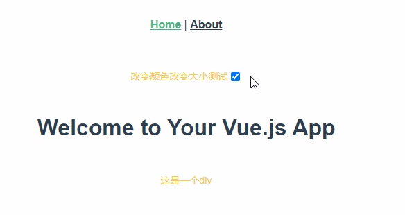

# less-modifyvars-demo

## Project setup
```
yarn install
```

### Compiles and hot-reloads for development
```
yarn serve
```

### Compiles and minifies for production
```
yarn build
```

### Lints and fixes files
```
yarn lint
```

### Customize configuration
See [Configuration Reference](https://cli.vuejs.org/config/).

效果如下：



遇到的坑总结：

1、写less的样式文件，使用@import 报错。

解决办法：在vue.config.js中加入如下配置即可：

```
module.exports = {
  css: {
    // css预设器配置项
    loaderOptions: {
        less: {
            // 若 less-loader 版本小于 6.0，请移除 lessOptions 这一级，直接配置选项。
            modifyVars: {
                // 初始化可直接覆盖变量
                '@error-color': '#1890FF',
              },
              javascriptEnabled: true
            },
          }
        }
};
```

2、写的less的样式文件夹styles，不放到public文件夹下，报错‘less.min.js:10 GET http://localhost:8080/src/styles/index.less 404 (Not Found)’，解决办法：

将styles文件夹放到public下，并在index.html中导入外部样式表。

3、用less.modifyVars切换样式不生效；代码如下：

```
    changeTheme () {
      console.log(this.theme, window.less)
      this.theme = !this.theme
      // 调用 `less.modifyVars` 方法来改变变量值
      // 定义variable.js是因为如果直接将less变量放在modifyVars中切换的效果只会生效一次，所以根据切换的状态使用对应的less变量。
      window.less.modifyVars(this.theme ? lightTheme : darkTheme)
    }
```

解决办法：需要在index.html中导入样式文件，然后再导入less.js解析less文件，先后顺序不能颠倒。less.js或less.min.js可在官网下载。


4、报less is not defined，解决办法：同上面，需要注意的是，标签的先后顺序不能颠倒。

